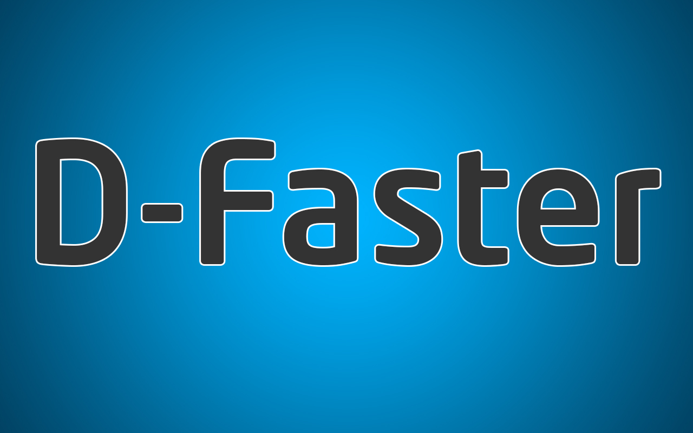

# D-Faster
### D-Faster is a set of Utilities for Developers/Designers.
It's based on open projects from Github to help you increase your development speed.D-Faster is made for fast.

The Project Still a baby & I work on it as a hobby in my spare time which isn't much. 

D-Faster has a great potential but i need your help to add new features & utilities so feel free to fork & modify what every you need & don't forget to send me a pull request of your modification.

The project uses plain HTML,CSS,JS with extensive use of AngularJs V1.
D-Faster also uses local-storage HTML 5 API as a DB manager.
Currently D-Faster doesn't use any backend technology, However the project is intended to be transfered to NodeJS & Express at some point. 

